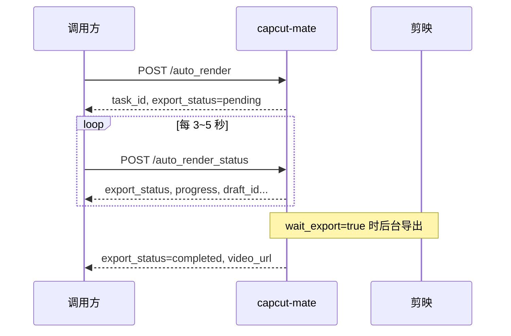

# AUTO_RENDER 自动化成片 API

## 接口概览

| 接口 | 方法 | 说明 |
|------|------|------|
| `/openapi/capcut-mate/v1/auto_render` | POST | 提交任务：建草稿（视频/字幕/转场）→ 可选剪映导出 |
| `/openapi/capcut-mate/v1/auto_render_status` | POST | 查询异步任务进度（建稿 + 导出） |

**服务地址**：`http://{API服务器IP}:30000`  
`{API服务器IP}` 为运行 `start-api-local.ps1` 的那台机器的局域网 IPv4，不是调用方自己的 IP。详见 [NEW-ENV-SETUP.md](../deploy/NEW-ENV-SETUP.md)。

---

## 推荐调用流程（异步，默认）



1. `POST /auto_render`，`async_mode=true`（默认）→ 拿到 `task_id`
2. 轮询 `POST /auto_render_status`，传入 `task_id`
3. 直到 `export_status` 为 `completed` / `failed` / `skipped`

---

## 一、POST /auto_render

### 功能

按顺序拼接多段视频、添加转场与字幕、保存草稿；可选提交剪映导出。

- **async_mode=true**（默认）：立即返回，不阻塞 HTTP
- **wait_export=true**：建稿完成后自动进入导出队列（剪映须在首页）
- **wait_export=false**：只建草稿，不导出

### 请求

```
POST /openapi/capcut-mate/v1/auto_render
Content-Type: application/json
```

#### 请求体示例（两段视频 + 叠化 + 四条字幕 + 异步导出）

```json
{
  "videos": [
    {
      "video_url": "https://teststatic.xuesee.net/sfs/coursedesignpc/qq.mp4",
      "use_full_duration": true
    },
    {
      "video_url": "https://teststatic.xuesee.net/sfs/coursedesignpc/qq.mp4",
      "use_full_duration": true
    }
  ],
  "captions": [
    { "text": "【视频1】开场", "start": 0, "end": 9979246 },
    { "text": "【视频1】重点", "start": 9979246, "end": 19958493 },
    { "text": "【视频2】转场后", "start": 19958493, "end": 29437739 },
    { "text": "【视频2】收尾", "start": 29437739, "end": 38916986 }
  ],
  "default_transition": "叠化",
  "default_transition_duration": 1000000,
  "font_size": 15,
  "caption_bottom_margin_px": 10,
  "text_color": "#ffffff",
  "wait_export": true,
  "async_mode": true,
  "api_base_url": "http://172.16.94.161:30000",
  "validate_caption_timeline": true
}
```

> 完整示例见项目根目录 `auto_render_test.json`。

#### 主要参数

| 参数 | 类型 | 必填 | 默认 | 说明 |
|------|------|------|------|------|
| videos | array | ✅ | - | 视频列表，按顺序首尾相接 |
| videos[].video_url | string | ✅ | - | MP4 等可下载 URL |
| videos[].use_full_duration | bool | ❌ | true | true 时自动探测原片全长 |
| videos[].start / end | int | 条件 | - | `use_full_duration=false` 时必填（微秒） |
| videos[].transition | string | ❌ | - | 本段末尾转场名，默认用 `default_transition` |
| videos[].transition_duration | int | ❌ | - | 本段转场时长（微秒） |
| captions | array | ❌ | [] | 字幕列表 |
| captions[].text | string | ✅ | - | 字幕文本 |
| captions[].start / end | int | ✅ | - | 成片时间轴起止（微秒） |
| captions[].font_size | int | ❌ | - | 单条字号，覆盖全局 `font_size` |
| default_transition | string | ❌ | 叠化 | 默认转场（最后一段不加） |
| default_transition_duration | int | ❌ | 1000000 | 默认转场 1 秒；叠化时后段提前等量重叠 |
| use_source_canvas | bool | ❌ | true | 画布跟随第一段源视频分辨率 |
| width / height | int | ❌ | 1920/1080 | `use_source_canvas=false` 时生效 |
| font_size | int | ❌ | 15 | 全局字幕字号 |
| text_color | string | ❌ | #ffffff | 字幕颜色 |
| caption_bottom_margin_px | int | ❌ | 10 | 距底边像素，自动计算字幕位置 |
| caption_transform_y | float | ❌ | null | 手动像素位移；**一般不传**，调试用 |
| validate_caption_timeline | bool | ❌ | true | 校验字幕覆盖整条成片时间轴 |
| wait_export | bool | ❌ | false | true 时建稿后自动导出 |
| async_mode | bool | ❌ | true | true 异步返回 task_id |
| api_base_url | string | ❌ | 127.0.0.1:30000 | **须为 API 服务器地址**，用于拼 draft_url |
| export_timeout_sec | int | ❌ | 1200 | 同步模式导出超时（秒） |
| poll_interval_sec | float | ❌ | 5.0 | 同步模式轮询间隔（秒） |

#### 字幕时间轴规则（validate_caption_timeline=true）

字幕时间按**成片时间轴**（含叠化重叠），单位**微秒**：

1. 第一条 `start = 0`
2. 最后一条 `end = 成片总时长`（响应里 `timeline_duration_us`）
3. 各条首尾相接，无空隙、无重叠
4. 所有 `(end - start)` 之和 = 成片总时长

两段各约 20s、叠化 1s 时，成片约 **38.9s**（38916986 μs）。换视频后须重算时间。

#### 字幕位置

默认不传 `caption_transform_y`，由 `caption_bottom_margin_px` + `font_size` + 画布高度自动算底部位。换分辨率会自动适配。

---

### 响应

HTTP 200，符合公司 API 规范 `{code, message, data}`（**code=1 表示成功**）：

```json
{
  "code": 1,
  "message": "任务已提交，请轮询 auto_render_status",
  "data": {
    "task_id": "a710c4dd6bd944bfae65ed27f28710fa",
    "draft_id": "",
    "draft_url": "",
    "export_status": "pending",
    "progress": 0,
    "video_url": "",
    "error_message": "",
    "message": "任务已提交，请轮询 auto_render_status",
    "timeline_duration_us": 0
  }
}
```

#### 顶层字段

| 字段 | 类型 | 说明 |
|------|------|------|
| code | int | **1** 成功，其它见错误码 |
| message | string | 接口级摘要 |
| data | object | 业务数据，失败时为 `null` |

#### data 内字段

| 字段 | 类型 | 说明 |
|------|------|------|
| task_id | string | 异步任务 ID，`async_mode=true` 时用于查询 |
| draft_id | string | 草稿 ID（建稿完成后才有） |
| draft_url | string | 草稿 URL |
| export_status | string | 见下表 |
| progress | int | 进度 0~100 |
| video_url | string | 成片 HTTP 地址（导出完成后） |
| error_message | string | 失败原因 |
| message | string | 任务阶段说明（如「正在剪映导出」） |
| timeline_duration_us | int | 成片时长（微秒），建稿完成后有值 |

**async_mode=false** 时 `data.task_id` 为空，请求阻塞至建稿/导出结束，结果在 `data` 中一次返回。

Apifox / 客户端取业务字段请读 **`response.data`**（或 `json.data`），不要直接从根对象取 `task_id`。

---

## 二、POST /auto_render_status

### 功能

查询 `async_mode=true` 提交的任务进度（建草稿 + 导出）。

### 请求

```
POST /openapi/capcut-mate/v1/auto_render_status
Content-Type: application/json
```

```json
{
  "task_id": "a710c4dd6bd944bfae65ed27f28710fa"
}
```

| 参数 | 类型 | 必填 | 说明 |
|------|------|------|------|
| task_id | string | ✅ | `/auto_render` 返回的 task_id |

### 响应

与 `/auto_render` 相同：`{code, message, data}`，轮询请读 **`data.export_status`** 直至终态。

#### export_status 状态说明

| 值 | 含义 | 建议 |
|----|------|------|
| pending | 排队等待建稿 | 继续轮询 |
| processing | 建稿中或导出中 | 继续轮询 |
| skipped | 未导出（`wait_export=false`） | 结束，用 draft_url 编辑 |
| completed | 导出成功 | 结束，取 `video_url` |
| failed | 建稿或导出失败 | 结束，看 `error_message` |

#### processing 阶段 data.message 参考

| data.message（示例） | 阶段 |
|-----------------|------|
| 任务排队中 | 等待 worker |
| 正在创建草稿（下载素材、拼接时间轴） | 建稿中，progress≈5 |
| 草稿已创建，正在提交导出 | 建稿完成，progress≈10 |
| 导出任务排队中 | 等待剪映，progress≈15 |
| 正在剪映导出 | progress 30~70 |
| 自动化成片完成 | export_status→completed |

---

## 三、调用示例

### cURL（Linux / Git Bash）

```bash
API=http://172.16.94.161:30000

# 1. 提交
curl -X POST "$API/openapi/capcut-mate/v1/auto_render" \
  -H "Content-Type: application/json; charset=utf-8" \
  --data-binary @auto_render_test.json

# 2. 查询（替换 TASK_ID）
curl -X POST "$API/openapi/capcut-mate/v1/auto_render_status" \
  -H "Content-Type: application/json" \
  -d '{"task_id":"TASK_ID"}'
```

### PowerShell

```powershell
$API = "http://172.16.94.161:30000"

# 1. 提交
curl.exe -X POST "$API/openapi/capcut-mate/v1/auto_render" `
  -H "Content-Type: application/json; charset=utf-8" `
  --data-binary "@auto_render_test.json"

# 2. 查询
$body = @{ task_id = "TASK_ID" } | ConvertTo-Json
Invoke-RestMethod -Method POST `
  -Uri "$API/openapi/capcut-mate/v1/auto_render_status" `
  -ContentType "application/json" `
  -Body $body | ConvertTo-Json -Depth 5
```

### Python 轮询（项目内脚本）

```powershell
python tests/manual_auto_export_poll.py
```

---

## 四、常见场景

### 只建草稿、不导出

```json
{
  "videos": [{ "video_url": "https://example.com/a.mp4", "use_full_duration": true }],
  "captions": [],
  "wait_export": false,
  "async_mode": true,
  "api_base_url": "http://172.16.94.161:30000"
}
```

终态：`export_status=skipped`，`draft_id` 有值。草稿会复制到剪映草稿目录（默认开启）。

### 同步阻塞（兼容旧客户端）

```json
{
  "async_mode": false,
  "wait_export": true,
  "api_base_url": "http://172.16.94.161:30000",
  "videos": [...]
}
```

HTTP 连接会一直保持到导出完成（可能数分钟），不推荐新集成使用。

---

## 五、错误与排查

| 现象 | 可能原因 |
|------|----------|
| code≠1，字幕相关 | 字幕时间与成片不符，看 `data.timeline_duration_us` 重算 |
| failed，未找到剪映草稿 | `DRAFT_SAVE_PATH` 与剪映草稿位置不一致；剪映不在首页 |
| video_url 无法访问 | `api_base_url` / 服务器 IP 填错；防火墙未放行 30000 |
| task_id 查不到 | task_id 错误或 API 进程已重启（内存任务丢失） |

导出前：**剪映专业版打开并停在首页**，服务器已 `pip install -e ".[windows]"`。

---

## 六、相关文档

- [NEW-ENV-SETUP.md](../deploy/NEW-ENV-SETUP.md) — 新环境部署与命令
- [gen_video.zh.md](./gen_video.zh.md) — 单独导出已有草稿
- [gen_video_status.zh.md](./gen_video_status.zh.md) — 单独查导出进度
- [api_response.zh.md](./api_response.zh.md) — 全站统一响应格式
- 根目录 `auto_render_test.json` — 可运行的请求示例
